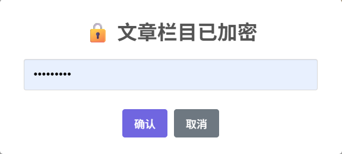
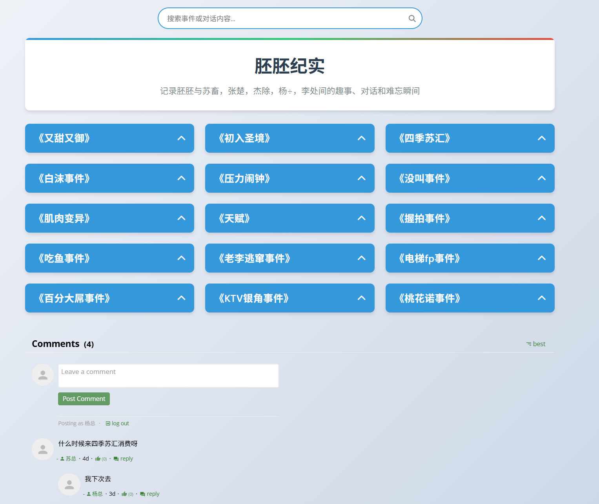
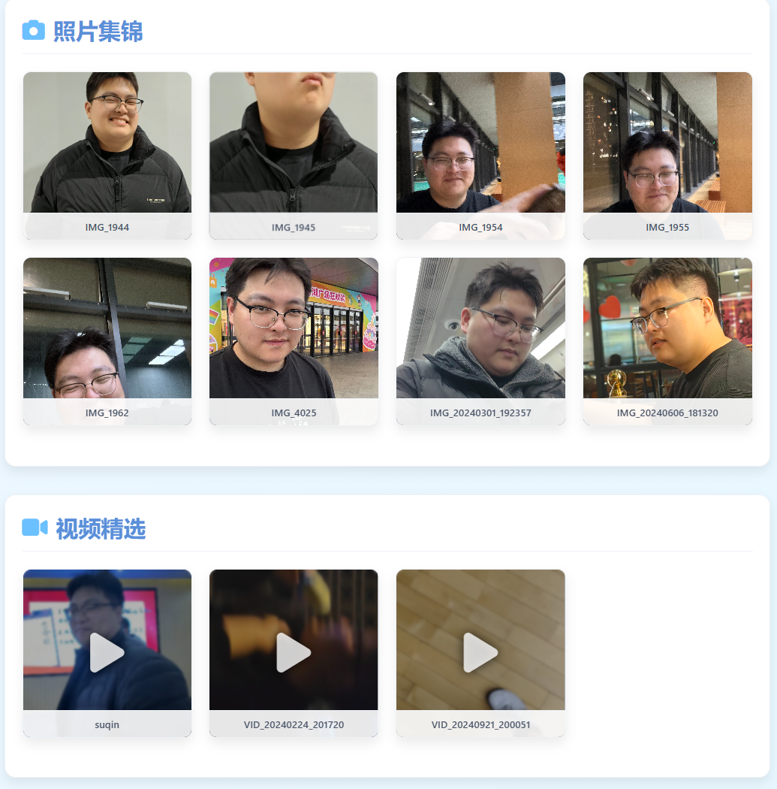

# 个人网站开发 - 项目说明

## 项目概述

[ZsYxY](https://zsyxy.dpdns.org/)是一个纪念大学期间七人友谊的网站，同时分享AI开发与足浴养生相关的技术内容。网站基于纯前端技术开发，托管在[Cloudflare Pages](https://dash.cloudflare.com/)，域名来自[FreeDomain](https://github.com/DigitalPlatDev/FreeDomain)。

<div align="center">
    
    
    
    
    
    
</div>

## 项目结构

```
DINOSAUR/
├── assets/                  # 静态资源文件夹（图片、视频等）
├── demo                     # 演示文件夹
├── js/                      # JavaScript脚本文件夹
│   └── password-protect.js  # 前端密码验证脚本
├── projects/                # 项目详情页面文件夹
├── index.html               # 网站首页
├── articles.html            # 文章列表页面（加密）
├── peizi.html               # "乳胚"纪念页面
├── pc.html                  # "足浴养生"页面（群友图片分类）
├── style.css                # 主样式表
├── README.md                # 项目说明文档
└── test.html                # 调试文件
```

## 网站功能与页面

### 1. 首页 (index.html)
- 展示最新技术文章摘要
- 包含三个主要项目介绍：
  - YOLO-IWCA: 智能垃圾分类助手
  - SPD: 基于深度学习的多模态坐姿检测系统
  - OpenCV人脸马赛克系统
- 侧边栏展示个人信息和GitHub项目

  

### 2. 文章列表 (articles.html)
- 加密访问的技术文章合集
- 使用SweetAlert2实现前端密码验证
- 
   


### 3. 乳胚纪念 (peizi.html)
- 记录大学七人友谊的趣事
- 采用对话卡片形式展示各类事件
- 包含搜索功能和折叠/展开交互
   

### 4. 足浴养生 (pc.html)
- 群友图片分类展示页面
- 按人物标签分类展示照片和视频
   

### 5. 项目详情 (projects/)
- 各技术项目的详细介绍页面
- 包含GitHub项目链接和技术细节

## 技术栈

- **前端框架**：纯HTML5/CSS3/JavaScript
- **UI组件库**：Font Awesome图标
- **交互组件**：SweetAlert2弹窗
- **托管平台**：Cloudflare Pages
- **域名服务**：FreeDomain提供的免费域名

## 设计特点

1. **响应式布局**：适配桌面和移动设备
2. **现代UI设计**：卡片式布局、悬停效果、平滑过渡
3. **内容分类**：技术文章与友谊纪念分区展示
4. **安全访问**：前端密码保护敏感内容
5. **社交媒体整合**：GitHub、Twitter、TikTok链接

## 如何运行

1. 克隆仓库：
   ```bash
   git clone https://github.com/dinosaurerer/dinosaur.git
   ```

2. 本地运行：
   - 直接打开`index.html`文件
   - 或使用Live Server等开发工具

3. 部署到Cloudflare：
   - 连接GitHub仓库到Cloudflare Pages
   - 设置构建命令（本静态站点无需构建）
   - 配置自定义域名

## 贡献指南

欢迎通过Pull Request贡献：
1. Fork本仓库
2. 创建新分支 (`git checkout -b feature/your-feature`)
3. 提交修改 (`git commit -am 'Add some feature'`)
4. 推送到分支 (`git push origin feature/your-feature`)
5. 创建Pull Request

## 特别致谢

- [commentbox](https://commentbox.io/)提供评论区支持
- [FreeDomain](https://github.com/DigitalPlatDev/FreeDomain) 提供免费域名
- [Font Awesome](https://fontawesome.com.cn/)提供免费图标
- [SweetAlert2](https://sweetalert.js.org/)提供弹窗组件
- 爆粉群的群友们
- 
   

## 许可证

本项目采用 [MIT License](LICENSE)，欢迎自由使用和修改。

---

**让技术记录成长，用代码珍藏友谊**  
© 2025 Dinosaur的技术博客 | [访问网站](https://zsyxy.dpdns.org/)